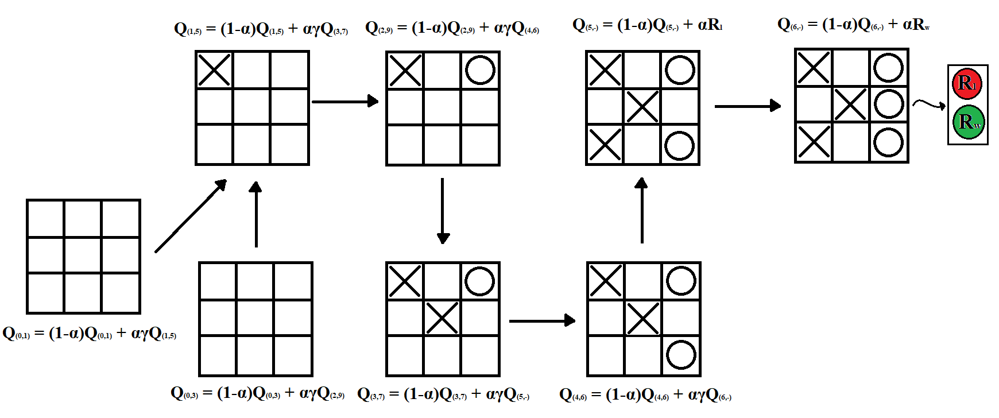
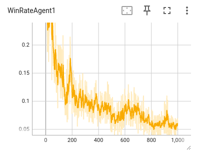
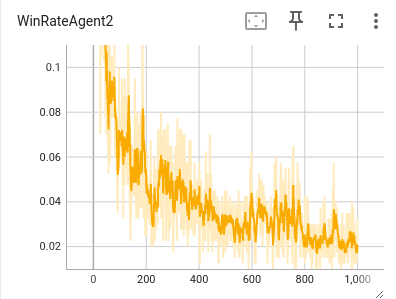
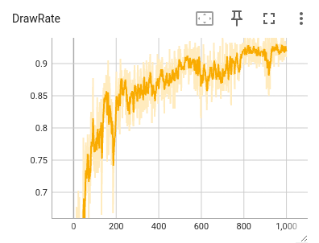
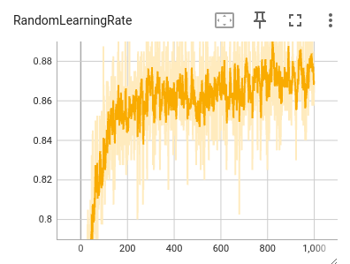

# TicTacToe RL
## Главная мысль
Воспользоваться методами обучения с подкреплением для формирования достойного противника в крестики-нолики.
## Краткое описание
Использовался табличный вариант Q-обучения с сэмплированием состояний среды. Для обучения использовался агент, который играл против самого себя. Контрольная оценка результатов работы производилась на случайном наборе ходов. Обновления ценностей действий происходили с помощью фукции ***backward***, она в свою очередь принимает конечное вознаграждение за партию и распространяет в обратном направлении по всем парам (состояние, действие) Рисунке №1 приведен пример ее работы. На Рисунках №2,3 представлен WinRate для имитируемых агентов, а на Рисунке №4 отношение их игр в ничью к общему числу эпиздов обучения.
## Результаты работы

Рисунок №1 - функция распространения

Рисунок №2 - winrate для первого агента

Рисунок №3 - winrate для второго агента

Рисунок №4 - drawRate

Рисунок №5 - agentWinRate против случайного набора

