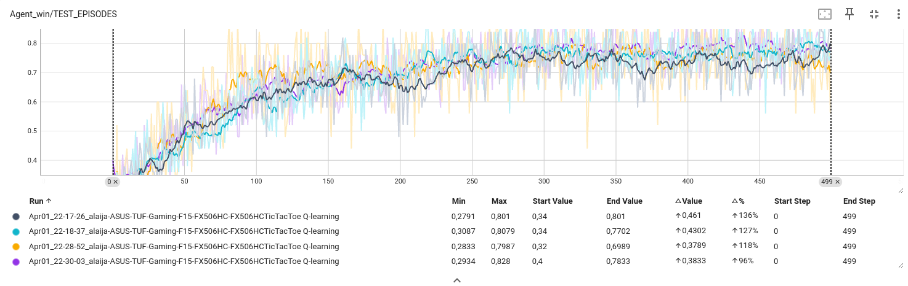

# TicTacToe RL
## Главная мысль
Воспользоваться методами обучения с подкреплением для формирования достойного противника в крестики-нолики.
## Краткое описание
Использовался табличный вариант Q-обучения с сэмплированием состояний среды. Для обучения применялся двойной цикл, внешняя часть которого представляет борьбу двух агентов, а внутреняя оценку конкурентоспобосности агентов против случайного набора действий. Как во внешнем, так и во внутреннем цикле агент обучается с помощью обратной функции обновления ценостей действий (***backward***). Обновление начинается с листа и распространяется до самого корня.
## Результаты работы
Получилось добиться результата, при котором агент одерживает победу в 75-80% случаев против случайного набора действий. На рисунке ниже представлены результаты.

